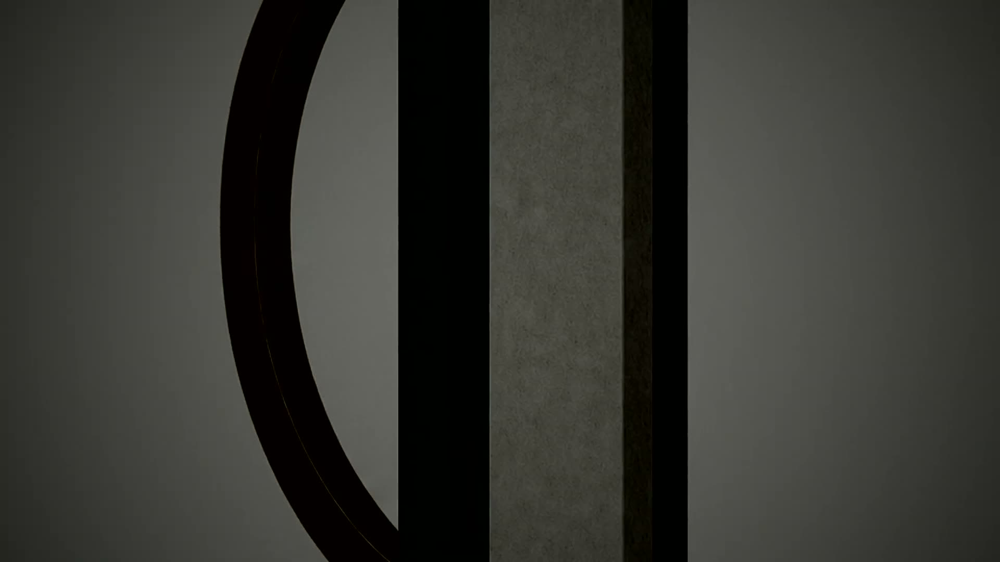
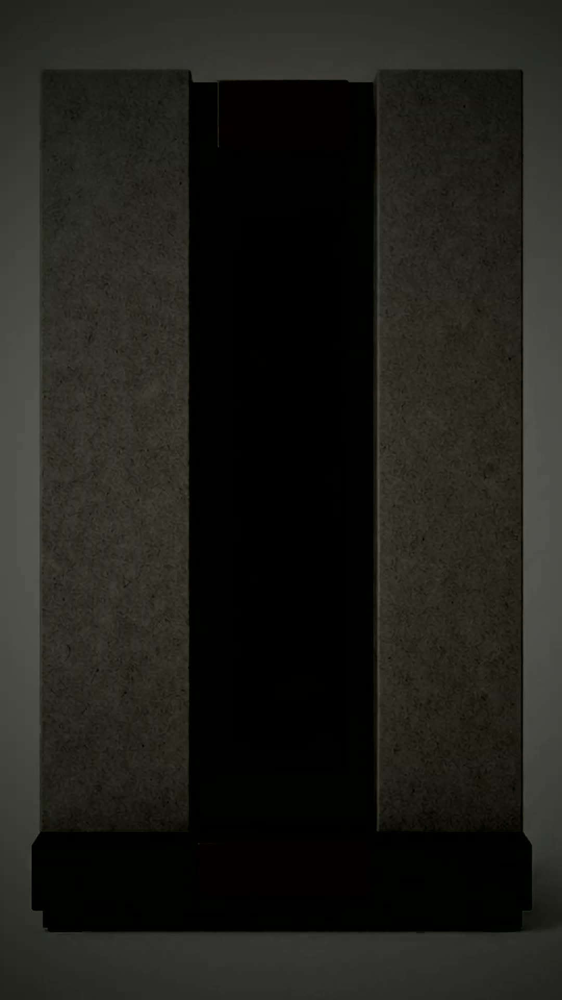
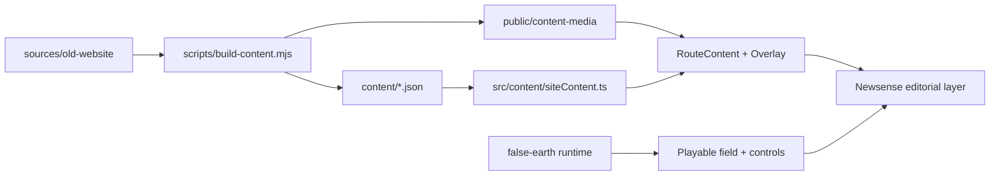

# Newsense Spatial


Spatial launch repository for Newsense: an immersive playable field runtime with
an editorial atlas layer, bundled legacy provenance, and generated branding/media
assets used for launch continuity.

## Brand + Launch Visuals

<p align="center">
  
</p>

| Surface | Preview |
|---|---|
| Desktop atmosphere |  |
| Mobile atmosphere |  |

Generated background motion assets are included in:
- `public/content-media/home/newsense-home-atmosphere-desktop.{webm,mp4}`
- `public/content-media/home/newsense-home-atmosphere-mobile.{webm,mp4}`

## What This Repo Holds

- `src/` — app runtime, field controls, overlays, route surfaces
- `content/` — generated runtime content package consumed by the app
- `public/` — launch media, 3D objects, textures, audio, and team assets
- `sources/old-website/` — curated legacy source bundle for rebuild provenance
- `sources/design-assets/` — generated ideation/reference packs for object design
- `planning/` — launch architecture and narrative planning docs

## Architecture



## Quick Start

```bash
npm install
npm run dev
```

Production build:

```bash
npm run build
```

Rebuild content package from a different legacy source root:

```bash
NEWSENSE_LEGACY_ROOT=/absolute/path/to/old-website npm run content:build
```

## Runtime + Source Boundaries

- Runtime-ready team media lives in `public/content-media/team/`
- Runtime-ready team model candidates live in `public/models/team/`
- `sources/team-asset-map.json` is used during content build to preserve selected mappings
- `sources/design-assets/` is kept as source/reference material and not auto-loaded into runtime by default

## Launch Notes (v0.1.0)

- Added generated home atmosphere motion/video packs for desktop + mobile
- Kept Newsense wordmark and launch visual identity assets in-repo
- Preserved design ideation source packs under `sources/design-assets/`
- Included team media/model fallback assets and curation map for build-time linking
- Applied field/route runtime updates and nested-route texture URL fixes

## License

This repository currently has no explicit LICENSE file. Add one before external redistribution.
