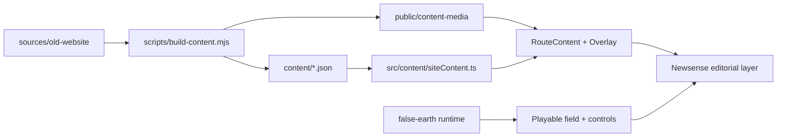

# Newsense Launch


Standalone launch repository for the new Newsense website: a playable field
experience with a floating editorial atlas, preserved studio wordmark, and a
bundled subset of the recovered legacy website sources needed to regenerate the
runtime content package.

## What This Repo Holds

- The live Newsense site implementation in `src/`
- The generated runtime content package in `content/`
- Runtime media, 3D objects, textures, and audio in `public/`
- The focused legacy source bundle needed for rebuilds in `sources/old-website/`
- Planning and architecture notes in `planning/`

This repo is intended to stand on its own. It no longer requires the Obsidian
vault path to run `content:build`.

## Experience Thesis

Newsense is framed as a move from nuisance into new sense.

- The field is the atmospheric, explorable layer.
- The atlas is the editorial, navigable layer.
- The projects are the proof surface.
- The preserved legacy source bundle keeps provenance and rebuildability intact.

## Architecture



## Repo Layout

```text
newsense-launch/
├── content/                  Generated runtime data consumed by the app
├── planning/                 Architecture and design notes
├── public/
│   ├── content-media/        Project media promoted for runtime use
│   ├── models/               Meshy-generated and scene objects
│   ├── textures/             false-earth and Newsense runtime textures
│   └── audio/                World audio assets
├── scripts/
│   └── build-content.mjs     Rebuilds runtime content from the bundled source set
├── sources/
│   └── old-website/          Focused legacy source bundle extracted from the vault
└── src/                      App, world, overlay, routing, and scene state
```

## Quick Start

```bash
npm install
npm run dev
```

Build the production bundle:

```bash
npm run build
```

If you ever want to rebuild the content package from a different legacy source
location, set:

```bash
NEWSENSE_LEGACY_ROOT=/absolute/path/to/old-website npm run content:build
```

## Key Surfaces

- `src/falseEarth/`: imported world runtime and controls
- `src/ui/`: Newsense overlay, route content, and field-mode UX
- `src/store/`: cross-layer scene state
- `content/site-content.json`: consolidated runtime content payload
- `sources/old-website/data/projects.json`: preserved project source data

## Notes

- The Newsense wordmark remains the canonical logo.
- The playable field stays intact; Newsense storytelling floats above it.
- The repo includes generated media needed to run the current site, but avoids
  shipping the full raw vault archive.
